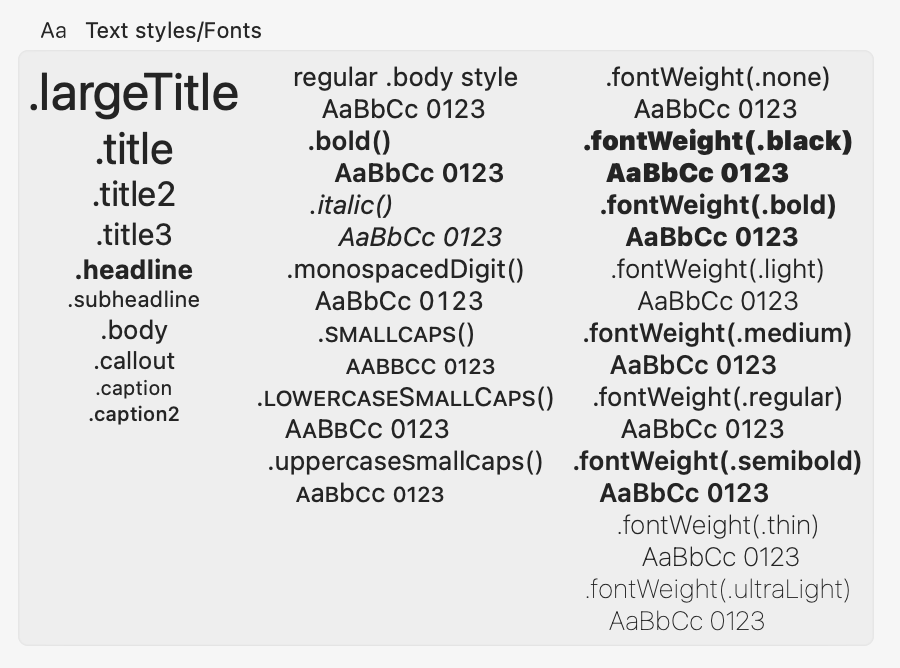
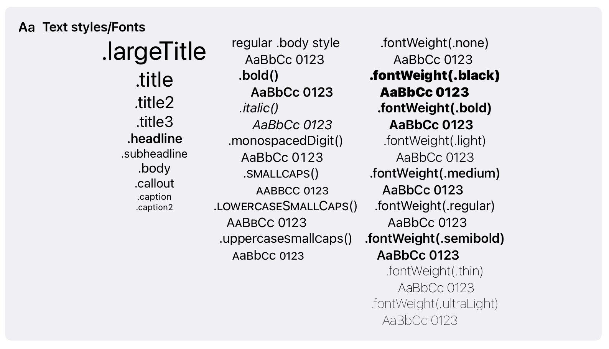
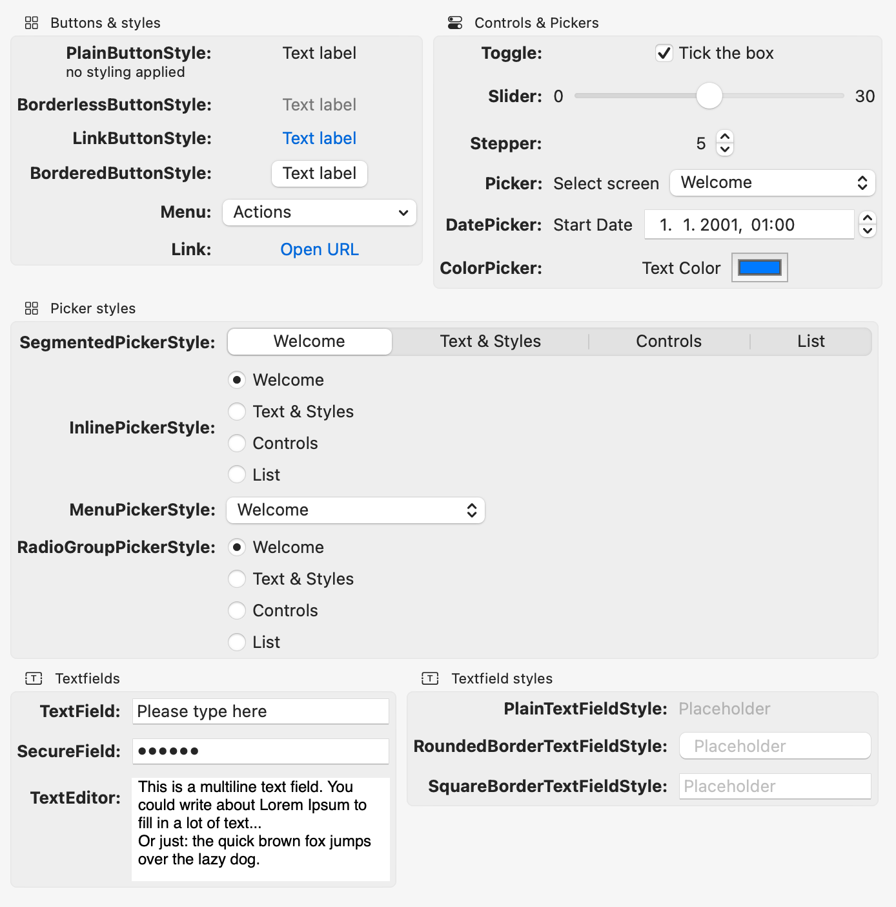
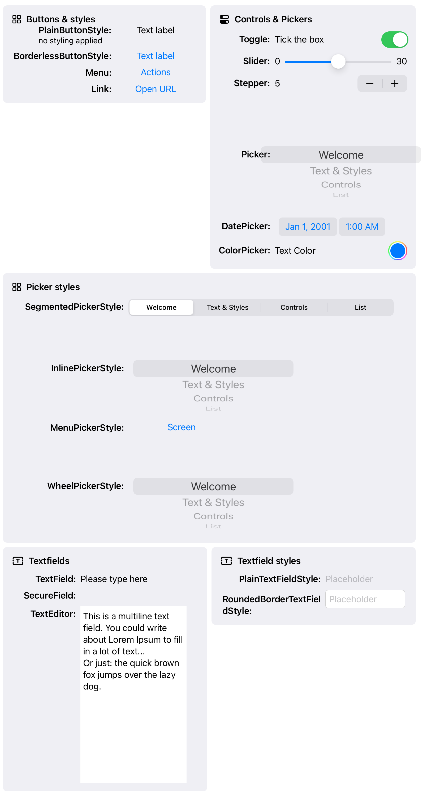

#  SwiftUI-Elements

The goal of this project is to play with SwiftUI control and elements on the main platforms (iOS and macOS) and find the proper way to use them.

I created this project because I'm missing an overview of how the various SwiftUI elements differ in appeareance on the platforms.

**This is work in progress**. As soon as I have some stable parts to explore, I will add screenshots here.

## Available text styles

### macOS

### iOS

## Available buttons & controls

### macOS

### iOS

